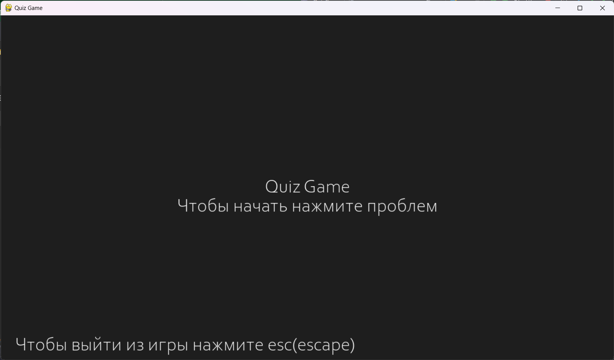
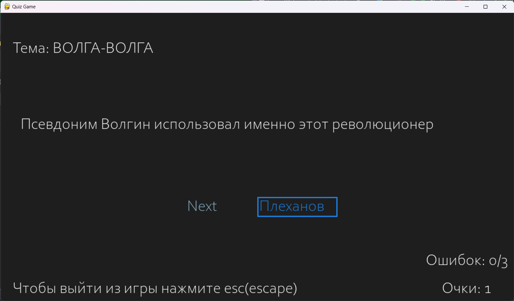
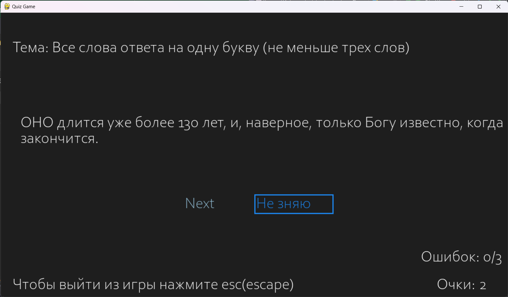
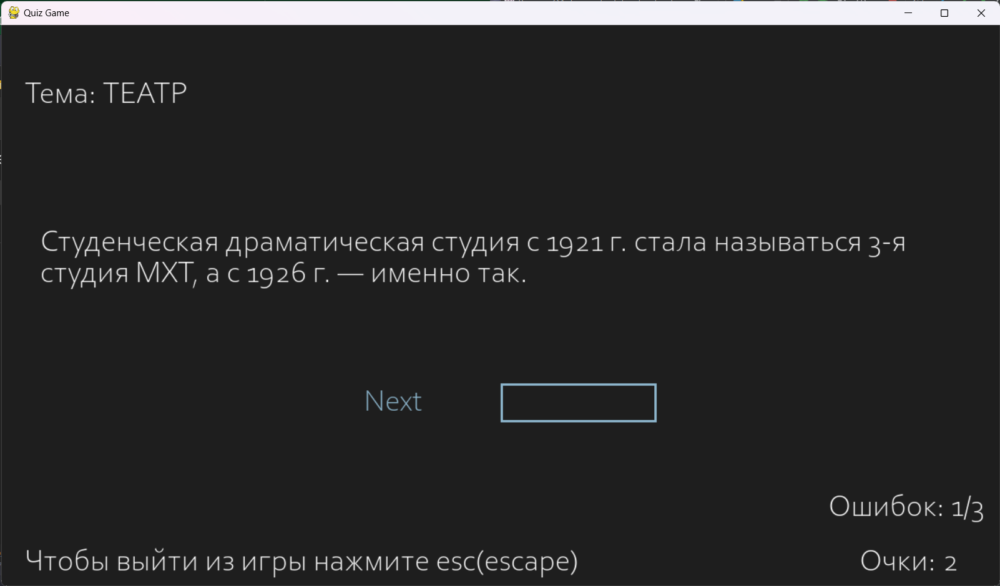

# QuizGame

QuizGame - это интерактивная игра викторина, разработанная на Python с использованием библиотеки Pygame. В игре выводятся вопросы на экран, игроки могут вводить свои ответы, оцениваться по правильности ответов, а также набирать очки. Каждый вопрос имеет определенную тему.

